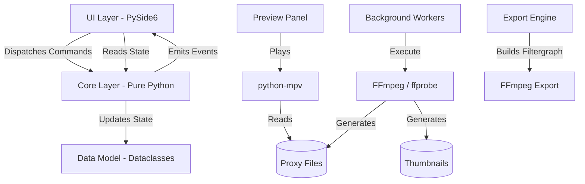
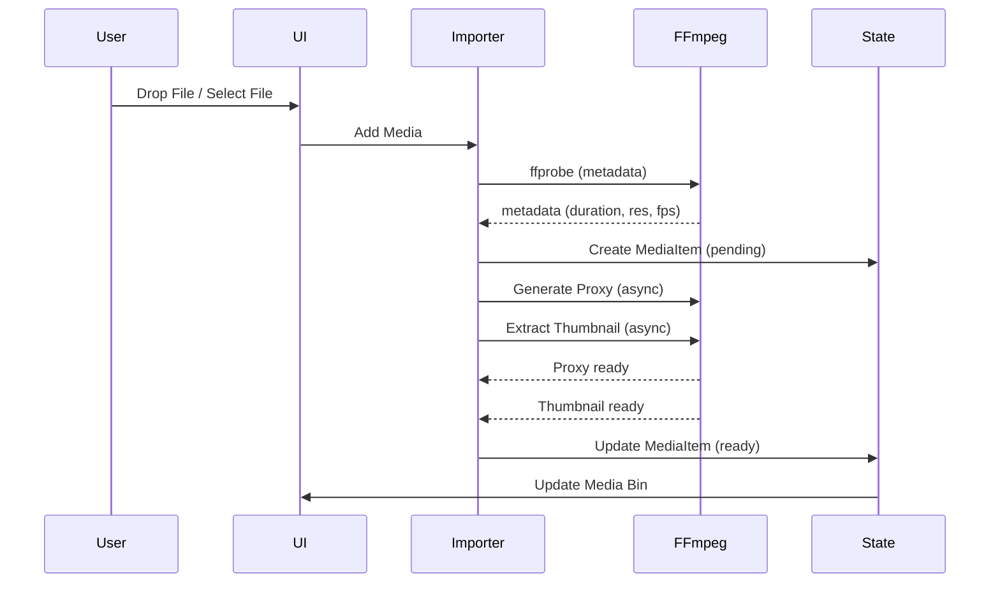
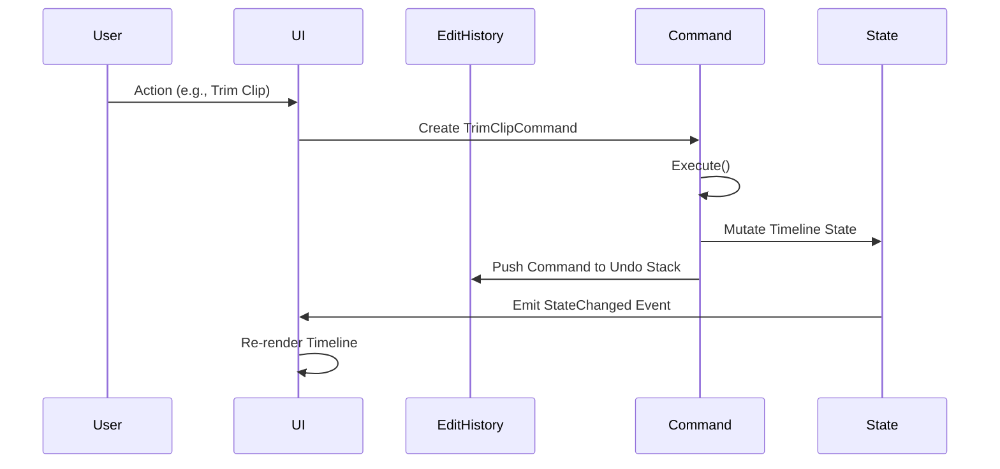
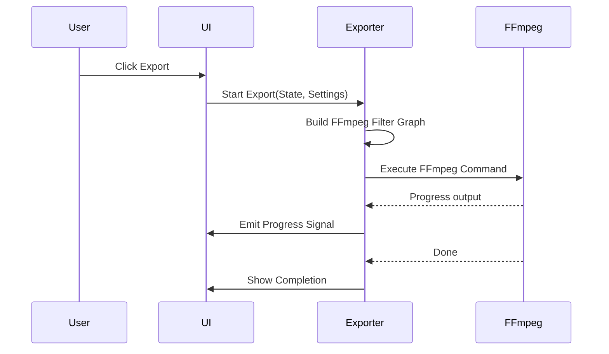
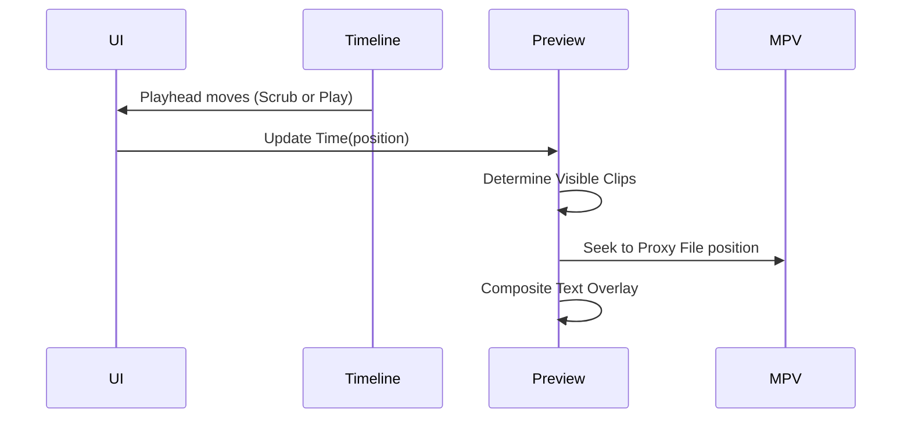

# Tempo Architecture Document

## 1. System Overview

Tempo is designed as a lightweight, CPU-only desktop video editor. It emphasizes a strict separation of concerns between the core data model (state), the user interface (Qt), and the media processing engine (FFmpeg). 

**Design Principles:**
- **Qt-Free Core:** The core business logic and state management are implemented in pure Python, independent of any UI framework. This allows for easier testing and potential future UI migrations.
- **Single Source of Truth:** The project state is maintained in a central data structure (Python dataclasses). The UI reflects this state and dispatches commands to mutate it.
- **Command Pattern:** All state mutations are handled via commands, enabling a robust Undo/Redo system and centralized state updates.

### Architecture Diagram



## 2. Directory Structure

```
tempo/
├── README.md, SPEC.md, ARCHITECTURE.md, ROADMAP.md, KEYBINDINGS.md
├── pyproject.toml, .python-version, ruff.toml, mypy.ini, .gitignore
├── tempo/
│   ├── __init__.py, __main__.py, app.py
│   ├── core/
│   │   ├── models.py, project.py, timeline.py, text_overlay.py, speed.py, edit_history.py
│   ├── media/
│   │   ├── importer.py, proxy.py, thumbnail.py, waveform.py, exporter.py
│   ├── ui/
│   │   ├── main_window.py, theme.py, keybindings.py
│   │   ├── panels/
│   │   │   ├── media_bin.py, preview.py, inspector.py, inspector_clip.py, inspector_text.py
│   │   └── timeline/
│   │       ├── timeline_widget.py, upper_timeline.py, lower_timeline.py, track_header.py, clip_item.py, text_clip_item.py, playhead.py, waveform_widget.py
│   └── utils/
│       ├── ffmpeg.py, timecode.py, cache.py, logger.py
├── assets/
│   ├── icons/
│   └── fonts/
├── tests/
└── scripts/
```

## 3. Data Flow Diagrams

### Import Flow


### Edit Flow


### Export Flow


### Preview Flow


## 4. Core Data Model

The application state is defined by Python `dataclasses`.

- **Clip**: `id`, `media_id`, `timeline_start`, `timeline_end`, `source_in`, `source_out`, `speed`, `pitch_correction`, `transition_in`, `transition_out`
- **Track**: `id`, `type` (Video/Audio), `index`, `clips` (list of Clip)
- **TextClip**: `id`, `timeline_start`, `timeline_end`, `content`, `font_family`, `font_size`, `colors`, `bold`, `italic`, `underline`, `alignment`, `position`, `rotation`
- **MediaItem**: `id`, `original_path`, `proxy_path`, `type`, `duration`, `width`, `height`, `fps`, `has_audio`, `thumbnail_path`
- **Project**: `version`, `name`, `created`, `modified`, `settings` (ProjectSettings), `media_list`, `timeline` (list of Track)
- **ProjectSettings**: `resolution` (tuple), `framerate`, `sample_rate`

## 5. Threading Model

To ensure a responsive UI, heavy operations are offloaded to background threads.

- **Main Thread**: Handles the Qt event loop, UI rendering, and user input.
- **QThread Workers**:
  - `ProxyGenerationWorker`: Executes FFmpeg to create proxies, emits progress signals.
  - `ThumbnailWorker`: Extracts thumbnails from video files.
  - `WaveformWorker`: Extracts audio peak data.
  - `ExportWorker`: Runs the final FFmpeg export command and parses progress.
- **Communication**: Thread-safe Signal/Slot pattern. Workers never touch UI widgets directly; they emit signals containing pure data (e.g., progress percentage, file paths).
- **Worker Pool**: A managed pool of workers prevents overwhelming the system with too many concurrent FFmpeg processes.

## 6. FFmpeg Integration Strategy

- **Abstraction**: All FFmpeg calls are routed through `utils/ffmpeg.py` to ensure consistency.
- **Probe**: `ffprobe` is used to extract metadata (duration, resolution, codec, fps, audio channels).
- **Proxy Generation**: Re-encode original media to a lower resolution (e.g., 720p or 480p) using a fast preset (e.g., `libx264` ultrafast).
- **Thumbnail**: Extract a single frame as a JPEG for the media bin and timeline.
- **Waveform**: Extract audio peak data for timeline visualization.
- **Export**: Construct a complex filter graph utilizing filters like `concat`, `xfade` (transitions), `setpts` (speed), `atempo` (audio speed/pitch), and `drawtext` (text overlays).
- **Error Handling**: Parse FFmpeg `stderr` for errors and warnings, and handle timeouts gracefully.

## 7. Proxy Cache Design

- **Cache Location**: `~/.tempo/proxies/` and `~/.tempo/thumbs/`.
- **Cache Key**: Hash of `(file_path + file_size + modification_time)`.
- **Proxy Naming**: `{hash}.mp4`.
- **Invalidation**: On project load, re-probe original files. If the original file is missing or modified (mismatching hash), the proxy is invalidated and regenerated.
- **Storage Management**: Implement a cleanup mechanism for orphaned proxies (files in cache not referenced by recent projects).

## 8. Undo/Redo Design

- **Pattern**: Command Pattern.
- **Base Class**: `EditCommand` (abstract base class with `execute()`, `undo()`, and `description` properties).
- **Concrete Commands**: `AddClipCommand`, `DeleteClipCommand`, `MoveClipCommand`, `TrimClipCommand`, `SplitClipCommand`, `ChangeSpeedCommand`, `AddTextCommand`, `ModifyTextCommand`, `AddTransitionCommand`.
- **EditHistory**: Manages a stack of commands with a configurable maximum depth (default: 100).
- **Group Commands**: Allows batching multiple operations (e.g., deleting multiple clips) into a single undoable unit.
- **Reactivity**: Signal emission occurs after every `execute()` or `undo()` to trigger UI updates.

## 9. Timeline Rendering

- **Framework**: `QGraphicsScene` / `QGraphicsView` based rendering for performance and flexibility.
- **Coordinate System**: X-axis represents time (configurable pixels-per-second ratio), Y-axis represents track index.
- **Components**:
  - `ClipItem`: Subclass of `QGraphicsRectItem`. Renders the thumbnail strip, speed badge, and transition indicators.
  - `TextClipItem`: A colored rectangle (e.g., purple) displaying a text preview.
  - `WaveformWidget`: Uses a custom painter to draw audio peak data efficiently.
  - `Playhead`: A vertical line that follows the current playback position.
- **Dual Timeline**:
  - `Upper Timeline`: A separate `QGraphicsScene` offering a zoomed-out, lower resolution view of the entire sequence, featuring a highlighted viewport rectangle representing the current view in the lower timeline.
- **Zooming**: Adjusts the pixels-per-second ratio and triggers a re-layout of all items.

## 10. Preview Player Integration

- **Engine**: `python-mpv` embedded within a `QWidget`.
- **Source**: Plays the generated proxy files for performance.
- **Synchronization**: Syncs with the timeline playhead position.
- **Text Overlays**: Composited via FFmpeg `drawtext` filter applied to the proxy stream. When text properties change in the inspector, a lightweight FFmpeg subprocess re-generates the overlay frame(s) and pipes them to MPV. This keeps text rendering consistent between preview and export — both use the same `drawtext` pipeline.
- **Transport Controls**: Maps UI actions (play, pause, seek, step frame) to MPV commands.
- **Shuttle Control**: J/K/L keyboard shortcuts managed by a state machine for fast forward, rewind, and normal playback speeds.

## 11. Critical Architecture Rules

1. **Never import Qt in `core/`**. Core logic must remain UI-agnostic.
2. **All FFmpeg operations** must pass through `utils/ffmpeg.py`.
3. **Proxy generation** must occur in a background thread.
4. **Timeline state** consists of pure Python dataclasses; the UI renders based on this state.
5. **Every state mutation** must be pushed to the undo stack via a Command.
6. **Keybindings** are centralized in `ui/keybindings.py`.
7. **Colors and fonts** must be sourced exclusively from `ui/theme.py`.
8. **No `.ui` files**. All UI is constructed programmatically.
9. **Type hints everywhere**. Code must pass `mypy --strict`.
10. **No feature creep**. Stick to the defined scope and core functionality.

## 12. Error Handling Strategy

- **FFmpeg Errors**: Parse `stderr`, present user-friendly error dialogs, and log details.
- **Missing Media**: Display a distinct icon indicator in the UI and provide a dialog to re-link missing files.
- **Project Corruption**: Validate project data on load. Always backup the existing project file before overwriting.
- **Crash Recovery**: See auto-save mechanism in Section 12a below.

## 12a. Auto-Save Design

Auto-save provides crash recovery and guards against data loss.

- **Interval**: Every 3 minutes (configurable, minimum 1 minute).
- **File Location**: `~/.tempo/autosave.tempo` — a standard `.tempo` JSON project file.
- **Trigger**: A `QTimer` on the main thread fires every 3 minutes. On each tick:
  1. Serialize the current `Project` dataclass to JSON (same path as `core/project.py:save_project`).
  2. Write atomically: write to a `.tmp` file first, then `os.replace()` to the final path.
  3. Log the auto-save timestamp.
- **Recovery on Launch**:
  1. On startup, check if `~/.tempo/autosave.tempo` exists.
  2. Compare its `modified_at` timestamp against the most recently opened project.
  3. If the auto-save is newer, show a dialog: *"Tempo found unsaved changes from a previous session. Recover?"*
  4. If the user accepts, load the auto-save as the active project.
  5. If the user declines, delete the auto-save file.
- **Clean Exit**: On normal application shutdown (`QApplication.aboutToQuit`), delete the auto-save file.
- **Dirty Flag**: Auto-save only writes if the project has unsaved changes (a `dirty` flag set by any `EditCommand.execute()` or `undo()`, cleared on manual save).
- **Thread Safety**: Serialization runs on the main thread (fast for JSON). If projects grow large enough to cause UI hitches, move serialization to a `QThread` with a snapshot of the project state.

## 13. Testing Strategy

- **Unit Tests**: Focus on the `core/` module. Fast, Qt-free tests verifying state mutations and command logic.
- **Integration Tests**: Test FFmpeg wrapper operations (requires FFmpeg installed on the testing machine).
- **UI Tests**: Minimal, focusing on critical interactions, utilizing snapshot-based testing if possible.
- **Runner**: `pytest`.

## 14. Optional: FastAPI Module

*Note: This module is NOT added by default. It is only included if cross-process communication is required.*

- **Network**: Binds to `127.0.0.1` on a random port.
- **Server**: `uvicorn`.
- **Routes**:
  - `GET /state`: Retrieves current project state.
  - `POST /export`: Triggers an export.
  - `GET /export/progress`: Streams export progress.
