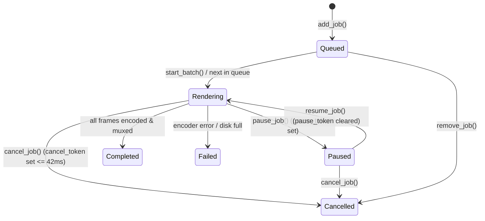

# System Design Document — Tempo 2

> **Status (2026-10-03): partly out of date.** Written for version 1.0. The product and
> interface documents take priority.
>
> Superseded here:
> - **§10 Plugin Host API (WASM)**: replaced by the Lua API in `PLUGIN_SPEC.md §7`.
> - **`TransitionKind::Plugin`** and effect registration: effects are fragment shaders with
>   declared parameters (`PLUGIN_SPEC.md §5`).
> - **Markers**: adding, moving, renaming and deleting markers are commands. Marker colours
>   follow `VISUAL_DESIGN.md §2.1`. Named markers become chapters on export.
> - **Export (§6)**: no pause state; jobs take a timeline snapshot; the "hardware exclusivity"
>   rule is dropped.
>
> Known problems, not yet rewritten:
> - **§1.2** `us_to_frame` / `frame_to_us` truncate, so a frame converted to time and back can
>   come out one lower. The code already rounds; this section should be brought in line.
> - **Keyframe times** are absolute timeline positions; they should be relative to the clip.
> - **`Command::execute(&self)`** cannot store undo data such as the deleted clip.
> - **Clip positions** are stored in pixels; they should be fractions of the frame.
> - Slider drags need to be grouped into one undo step.

**Version:** 1.0  
**Status:** Approved  

This document defines all core data structures, the command system, inter-component interfaces,
and critical algorithms. All Rust types shown are authoritative — implementation must match.

---

## 1. Core Data Types (`tempo-timeline`)

### 1.1 Identifiers

```rust
// All IDs are stable across project saves and undo/redo.
// UUIDs stored as TEXT in SQLite.
pub type ClipId    = uuid::Uuid;
pub type TrackId   = uuid::Uuid;
pub type MarkerId  = uuid::Uuid;
pub type SourceId  = uuid::Uuid;  // identifies a media source file
pub type PluginId  = String;       // reverse-DNS: "dev.tempo.code-mode"
```

### 1.2 Timecode

All time in the timeline is measured in microseconds from the start of the timeline.
This avoids floating-point precision issues when dealing with non-integer FPS (e.g., 23.976).

```rust
/// Microseconds from timeline start. Always non-negative for timeline positions.
/// Can be negative for internal arithmetic.
pub type TimeUs = i64;

/// Convert between TimeUs and frame numbers for display purposes.
pub fn us_to_frame(time_us: TimeUs, fps_num: u32, fps_den: u32) -> i64 {
    // frame = time_us * fps_num / (fps_den * 1_000_000)
    (time_us as i128 * fps_num as i128 / (fps_den as i128 * 1_000_000)) as i64
}

pub fn frame_to_us(frame: i64, fps_num: u32, fps_den: u32) -> TimeUs {
    // us = frame * fps_den * 1_000_000 / fps_num
    (frame as i128 * fps_den as i128 * 1_000_000 / fps_num as i128) as TimeUs
}
```

### 1.3 Project

```rust
pub struct Project {
    pub id: uuid::Uuid,
    pub name: String,
    pub created_at: chrono::DateTime<chrono::Utc>,
    pub modified_at: chrono::DateTime<chrono::Utc>,
    pub settings: ProjectSettings,
    pub timeline: Timeline,
    pub media_pool: MediaPool,
    pub markers: Vec<Marker>,
    pub plugin_configs: HashMap<PluginId, serde_json::Value>,
}

pub struct ProjectSettings {
    pub width: u32,          // e.g., 1920
    pub height: u32,         // e.g., 1080
    pub fps_num: u32,        // e.g., 30000 (for 29.97: 30000/1001)
    pub fps_den: u32,        // e.g., 1001
    pub sample_rate: u32,    // e.g., 48000
    pub channels: u8,        // 2 for stereo
    pub proxy_dir: PathBuf,  // where proxy files are stored
    pub autosave_interval_s: u32,
    pub frame_cache_mb: u32,
}
```

### 1.4 Media Source

A `MediaSource` represents a file on disk. Many clips can reference the same source.

```rust
pub struct MediaSource {
    pub id: SourceId,
    pub path: PathBuf,             // absolute path at time of import
    pub relative_path: PathBuf,    // relative to project file (for portability)
    pub media_type: MediaType,
    pub duration_us: TimeUs,       // total duration of the source file
    pub video: Option<VideoInfo>,
    pub audio: Option<AudioInfo>,
    pub proxy_path: Option<PathBuf>, // None = no proxy generated yet
    pub is_missing: bool,            // true if file not found at last open
}

pub enum MediaType { Video, Audio, Image, }

pub struct VideoInfo {
    pub width: u32,
    pub height: u32,
    pub fps_num: u32,
    pub fps_den: u32,
    pub codec: String,       // e.g., "h264", "hevc", "vp9"
    pub color_range: ColorRange,
    pub color_space: ColorSpace,
    pub bit_depth: u8,
    pub has_alpha: bool,
}

pub struct AudioInfo {
    pub sample_rate: u32,
    pub channels: u8,
    pub codec: String,       // e.g., "aac", "mp3", "flac"
    pub bit_depth: Option<u8>,
}
```

### 1.5 Timeline

```rust
pub struct Timeline {
    pub tracks: Vec<Track>,
    pub duration_us: TimeUs,  // computed: max clip end time across all tracks
}

impl Timeline {
    /// Return all clips that overlap the given position, in z-order (back to front).
    pub fn clips_at_time(&self, position_us: TimeUs) -> Vec<ClipAtTime>;

    /// Return all clips in a time range [start, end).
    pub fn clips_in_range(&self, start_us: TimeUs, end_us: TimeUs) -> Vec<&Clip>;

    /// Recompute duration_us. Called after any clip mutation.
    pub fn recompute_duration(&mut self);
}

pub struct ClipAtTime<'a> {
    pub clip: &'a Clip,
    pub track: &'a Track,
    pub source_offset_us: TimeUs, // position within the source file to decode
}
```

### 1.6 Track

```rust
pub struct Track {
    pub id: TrackId,
    pub kind: TrackKind,
    pub name: String,
    pub clips: Vec<Clip>,    // sorted by timeline_in ascending, no overlaps guaranteed
    pub enabled: bool,       // false = mute (audio) / hide (video)
    pub locked: bool,
    pub height_px: u32,      // display height in timeline (user-resizable)
    pub volume: f32,         // master track volume, 0.0–2.0, default 1.0 (audio tracks)
    pub solo: bool,          // audio tracks only
}

pub enum TrackKind {
    Video { index: u8 },  // V1=1, V2=2, V3=3, V4=4
    Audio { index: u8 },  // A1=1, A2=2, A3=3, A4=4
}
```

### 1.7 Clip

```rust
pub struct Clip {
    pub id: ClipId,
    pub source_id: SourceId,

    /// Where this clip starts on the timeline (microseconds from timeline zero)
    pub timeline_in: TimeUs,

    /// Where this clip ends on the timeline (exclusive)
    pub timeline_out: TimeUs,

    /// The point in the source file this clip starts reading from
    pub source_in: TimeUs,

    /// The point in the source file this clip stops reading (exclusive)
    /// Invariant: source_out - source_in == timeline_out - timeline_in
    pub source_out: TimeUs,

    pub name: String,           // defaults to filename
    pub clip_type: ClipType,
    pub properties: ClipProperties,

    /// Transition at the in-point of this clip (if any)
    pub transition_in: Option<Transition>,

    /// Transition at the out-point of this clip (if any)
    pub transition_out: Option<Transition>,
}

impl Clip {
    /// Duration of this clip in the timeline
    pub fn duration(&self) -> TimeUs {
        self.timeline_out - self.timeline_in
    }

    /// Given a timeline position within this clip, return the source offset to decode
    pub fn source_offset_at(&self, timeline_pos: TimeUs) -> TimeUs {
        self.source_in + (timeline_pos - self.timeline_in)
    }
}

pub enum ClipType {
    Video,
    Audio,
    Image { freeze_frame: bool },   // images loop or freeze
    Title(TitleData),
}

pub struct ClipProperties {
    // Video properties
    pub opacity: f32,         // 0.0–1.0, default 1.0
    pub position: (f32, f32), // X/Y offset in pixels from center, default (0.0, 0.0)
    pub scale: (f32, f32),    // X/Y scale factor, default (1.0, 1.0)
    pub rotation: f32,        // degrees, default 0.0

    // Audio properties
    pub volume: f32,          // 0.0–2.0, default 1.0
    pub pan: f32,             // -1.0 (left) to 1.0 (right), default 0.0
    pub muted: bool,

    // Basic color correction
    pub lift: [f32; 3],       // RGB, default [0.0, 0.0, 0.0]
    pub gamma: [f32; 3],      // RGB, default [1.0, 1.0, 1.0]
    pub gain: [f32; 3],       // RGB, default [1.0, 1.0, 1.0]

    // Keyframes (linear interpolation only in 1.0)
    pub keyframes: Vec<Keyframe>,
}

pub struct Keyframe {
    pub time_us: TimeUs,            // absolute timeline position
    pub property: KeyframeProperty,
    pub value: f64,
}

pub enum KeyframeProperty {
    Opacity, PositionX, PositionY, ScaleX, ScaleY, Rotation, Volume,
}
```

### 1.8 Title Data

```rust
pub struct TitleData {
    pub title_type: TitleType,
    pub text: String,
    pub subtitle: Option<String>,   // lower third only
    pub font_family: String,        // system font name
    pub font_size: f32,             // pt
    pub font_bold: bool,
    pub font_italic: bool,
    pub color: [u8; 4],             // RGBA
    pub background_color: Option<[u8; 4]>,
    pub background_padding: f32,    // px
    pub custom_position: Option<(f32, f32)>, // None = type default position
}

pub enum TitleType {
    CenterTitle,  // text centered in frame
    LowerThird,   // positioned lower third, with optional subtitle
}
```

### 1.9 Transition

```rust
pub struct Transition {
    pub kind: TransitionKind,
    pub duration_us: TimeUs,
    pub alignment: TransitionAlignment,
}

pub enum TransitionKind {
    Cut,
    CrossDissolve,
    DipToBlack,
    DipToWhite,
    FadeIn,     // only valid for transition_in
    FadeOut,    // only valid for transition_out
    Plugin(PluginId, serde_json::Value),  // plugin-provided transition + params
}

pub enum TransitionAlignment {
    Centered,       // transition centered on edit point
    StartAtCut,     // transition starts at edit point
    EndAtCut,       // transition ends at edit point
}
```

### 1.10 Marker

```rust
pub struct Marker {
    pub id: MarkerId,
    pub position_us: TimeUs,
    pub name: String,
    pub color: MarkerColor,
    pub duration_us: TimeUs,  // 0 = point marker, >0 = range marker
    pub note: String,
}

pub enum MarkerColor { Red, Green, Blue, Yellow, Orange, Purple }
```

### 1.11 Media Pool

```rust
pub struct MediaPool {
    pub bins: Vec<Bin>,
    pub sources: HashMap<SourceId, MediaSource>,
}

pub struct Bin {
    pub id: uuid::Uuid,
    pub name: String,
    pub parent: Option<uuid::Uuid>,  // None = root bin
    pub source_ids: Vec<SourceId>,
}
```

---

## 2. Command System (Undo/Redo)

### 2.1 Design

Every mutation to project state goes through the `CommandLog`. Commands are traits with `execute`
and `undo` methods. The log stores commands as `Box<dyn Command>` objects.

```rust
pub trait Command: Send + 'static {
    /// Apply the command to the project. Returns Err if preconditions are not met.
    fn execute(&self, project: &mut Project) -> Result<(), CommandError>;

    /// Reverse the command. The project must be in the state after execute().
    fn undo(&self, project: &mut Project) -> Result<(), CommandError>;

    /// Human-readable description shown in Edit menu ("Undo Delete Clip")
    fn description(&self) -> &str;
}

pub struct CommandLog {
    history: Vec<Box<dyn Command>>,
    cursor: usize,   // points to the next undo position (history[cursor-1] is last done)
    max_size: usize,
}

impl CommandLog {
    pub fn execute(&mut self, cmd: Box<dyn Command>, project: &mut Project) -> Result<()> {
        cmd.execute(project)?;
        // Truncate any redo history beyond cursor
        self.history.truncate(self.cursor);
        self.history.push(cmd);
        self.cursor += 1;
        // Trim oldest if over max_size
        if self.history.len() > self.max_size {
            self.history.remove(0);
            self.cursor -= 1;
        }
        Ok(())
    }

    pub fn undo(&mut self, project: &mut Project) -> Result<()> {
        if self.cursor == 0 { return Ok(()); }
        self.cursor -= 1;
        self.history[self.cursor].undo(project)
    }

    pub fn redo(&mut self, project: &mut Project) -> Result<()> {
        if self.cursor >= self.history.len() { return Ok(()); }
        self.history[self.cursor].execute(project)?;
        self.cursor += 1;
        Ok(())
    }
}
```

### 2.2 Concrete Command Types

```rust
// Insert a clip at a position
pub struct InsertClipCmd {
    track_id: TrackId,
    clip: Clip,             // the clip to insert (fully constructed)
    ripple: bool,           // true = ripple following clips right
}

// Delete a clip
pub struct DeleteClipCmd {
    clip_id: ClipId,
    track_id: TrackId,
    // Stored on execute so undo can re-insert at same position:
    deleted_clip: Option<Clip>,  // populated by execute()
}

// Move a clip (within or between tracks)
pub struct MoveClipCmd {
    clip_id: ClipId,
    from_track: TrackId,
    to_track: TrackId,
    old_timeline_in: TimeUs,
    new_timeline_in: TimeUs,
}

// Trim a clip in-point or out-point
pub struct TrimClipCmd {
    clip_id: ClipId,
    edge: TrimEdge,        // In or Out
    old_time: TimeUs,
    new_time: TimeUs,
}

pub enum TrimEdge { In, Out }

// Split a clip at a position
pub struct SplitClipCmd {
    clip_id: ClipId,
    split_at: TimeUs,           // timeline position
    // Stored on execute:
    left_clip_id: Option<ClipId>,
    right_clip_id: Option<ClipId>,
}

// Set a clip property
pub struct SetClipPropertyCmd {
    clip_id: ClipId,
    property: ClipPropertyChange,
}

pub enum ClipPropertyChange {
    Volume(f32, f32),        // (old, new)
    Opacity(f32, f32),
    Position((f32,f32), (f32,f32)),
    Scale((f32,f32), (f32,f32)),
    Rotation(f32, f32),
    Muted(bool, bool),
    Name(String, String),
    Lift([f32;3], [f32;3]),
    Gamma([f32;3], [f32;3]),
    Gain([f32;3], [f32;3]),
}

// Add/remove/edit transition
pub struct SetTransitionCmd {
    clip_id: ClipId,
    edge: TransitionEdge,    // In or Out
    old_transition: Option<Transition>,
    new_transition: Option<Transition>,
}

pub enum TransitionEdge { In, Out }

// Add/move/delete marker
pub struct AddMarkerCmd { marker: Marker }
pub struct DeleteMarkerCmd { marker_id: MarkerId, deleted_marker: Option<Marker> }
pub struct MoveMarkerCmd { marker_id: MarkerId, old_pos: TimeUs, new_pos: TimeUs }
```

---

## 3. Media Engine Interface (`tempo-media`)

```rust
pub struct MediaEngine {
    sources: HashMap<SourceId, SourceHandle>,
    vaapi_ctx: Option<VaapiContext>,    // None if VAAPI unavailable
}

pub struct SourceHandle {
    pub info: MediaSource,
    decoder: Arc<Mutex<FfmpegDecoder>>,
}

impl MediaEngine {
    /// Probe a file — reads container metadata only, no decoding.
    /// Returns within 100ms for any supported format.
    pub async fn probe(&self, path: &Path) -> Result<MediaSource>;

    /// Register a probed source into the engine.
    pub fn register(&mut self, source: MediaSource) -> SourceId;

    /// Decode the video frame closest to `source_offset_us` in source `id`.
    /// Returns a decoded YUV frame or RGB frame depending on source codec.
    /// This is a blocking call — run from Decode Thread Pool.
    pub fn decode_video_frame(
        &self,
        source_id: SourceId,
        source_offset_us: TimeUs,
    ) -> Result<VideoFrame>;

    /// Decode audio samples for a given range in the source.
    pub fn decode_audio_range(
        &self,
        source_id: SourceId,
        start_us: TimeUs,
        end_us: TimeUs,
        target_sample_rate: u32,
        target_channels: u8,
    ) -> Result<AudioBuffer>;

    /// Generate a waveform summary for a source (peak/RMS per block).
    /// Blocking, run from thread pool.
    pub fn generate_waveform(
        &self,
        source_id: SourceId,
        blocks: usize,
    ) -> Result<WaveformData>;

    /// Generate a thumbnail for the source at `source_offset_us`.
    /// Returns a 160×90 RGBA image.
    pub fn generate_thumbnail(
        &self,
        source_id: SourceId,
        source_offset_us: TimeUs,
    ) -> Result<Vec<u8>>;
}

pub struct VideoFrame {
    pub width: u32,
    pub height: u32,
    pub format: PixelFormat,     // Yuv420, Yuv422, Rgb, Rgba, ...
    pub data: Vec<u8>,
    pub pts_us: TimeUs,          // actual PTS of this frame
}

pub struct AudioBuffer {
    pub sample_rate: u32,
    pub channels: u8,
    pub samples: Vec<f32>,       // interleaved, f32 normalized -1.0 to 1.0
}

pub struct WaveformData {
    pub blocks: Vec<WaveformBlock>,
    pub sample_rate: u32,
    pub channels: u8,
}

pub struct WaveformBlock {
    pub peak_pos: f32,   // 0.0–1.0
    pub peak_neg: f32,   // -1.0–0.0
    pub rms: f32,        // 0.0–1.0
}
```

---

## 4. Frame Cache (`tempo-render`)

```rust
pub struct FrameCache {
    entries: LinkedHashMap<FrameCacheKey, CachedFrame>,  // ordered by access time
    current_bytes: usize,
    max_bytes: usize,
}

#[derive(Hash, Eq, PartialEq, Clone)]
pub struct FrameCacheKey {
    pub source_id: SourceId,
    pub pts_us: TimeUs,          // quantized to frame boundary
}

pub struct CachedFrame {
    pub texture: wgpu::Texture,  // uploaded to GPU
    pub size_bytes: usize,
    pub last_accessed: Instant,
}

impl FrameCache {
    /// Look up a frame. Returns Some if cached (updates LRU order).
    pub fn get(&mut self, key: &FrameCacheKey) -> Option<&wgpu::Texture>;

    /// Insert a frame. Evicts LRU entries if over budget.
    pub fn insert(&mut self, key: FrameCacheKey, frame: VideoFrame, device: &wgpu::Device);

    /// Evict all frames for a source (e.g., when source is removed from project).
    pub fn evict_source(&mut self, source_id: SourceId);

    /// Current memory usage in bytes.
    pub fn used_bytes(&self) -> usize;
}
```

---

## 5. Proxy Engine (`tempo-proxy`)

```rust
pub struct ProxyEngine {
    active_jobs: HashMap<SourceId, ProxyJob>,
    proxy_dir: PathBuf,
    thread_pool: rayon::ThreadPool,  // low-priority pool, 1-2 threads max
}

pub struct ProxyJob {
    pub source_id: SourceId,
    pub progress: Arc<AtomicF32>,     // 0.0–1.0
    pub cancel: Arc<AtomicBool>,
}

impl ProxyEngine {
    /// Measure the decode throughput of a source and determine if proxy is needed.
    /// Returns true if proxy generation should be started.
    pub async fn should_proxy(
        &self,
        source_id: SourceId,
        timeline_fps: f64,
    ) -> bool;

    /// Start background proxy generation. Sends progress via AppMessage channel.
    pub fn start_proxy(&mut self, source_id: SourceId, source: &MediaSource);

    /// Cancel proxy generation for a source.
    pub fn cancel_proxy(&mut self, source_id: SourceId);
}

// Proxy output format: H.264, CRF 18, same resolution as original.
// Output filename: {source_id}.proxy.mp4 in proxy_dir.
// Proxy uses FFmpeg's pipe API: decode via source codec → encode to H.264.
// Uses all available proxy thread pool threads for encode (-threads N).
```

---

## 6. Export Pipeline & Render Queue (`tempo-export`)

`tempo-export` manages asynchronous video rendering, hardware-accelerated encoding via VAAPI/FFmpeg, and multi-job batch queueing.

```rust
use std::sync::atomic::{AtomicBool, Ordering};
use std::sync::mpsc::{Sender, Receiver};
use std::sync::Arc;
use std::path::PathBuf;
use std::time::Duration;
use uuid::Uuid;

pub type JobId = Uuid;

#[derive(Debug, Clone, PartialEq, Eq)]
pub enum ExportJobState {
    Queued,
    Rendering {
        frames_done: u64,
        frames_total: u64,
        fps: f32,
        elapsed: Duration,
        eta: Option<Duration>,
    },
    Paused {
        frames_done: u64,
        frames_total: u64,
    },
    Completed {
        duration: Duration,
        file_size_bytes: u64,
    },
    Cancelled,
    Failed {
        error: String,
    },
}

pub struct ExportJob {
    pub id: JobId,
    pub name: String,
    pub project: Arc<Project>,
    pub settings: ExportSettings,
    pub range: ExportRange,
    pub output_path: PathBuf,
    pub state: ExportJobState,
    pub cancel_token: Arc<AtomicBool>,
    pub pause_token: Arc<AtomicBool>,
}

pub struct ExportSettings {
    pub video_codec: VideoCodec,
    pub crf: Option<u32>,                  // None = use target_bitrate
    pub target_bitrate_kbps: Option<u32>,
    pub width: u32,
    pub height: u32,
    pub fps_num: u32,
    pub fps_den: u32,
    pub audio_codec: AudioCodec,
    pub audio_bitrate_kbps: u32,
    pub sample_rate: u32,
    pub use_vaapi: bool,
}

pub enum ExportRange {
    EntireTimeline,
    InOut { start_us: TimeUs, end_us: TimeUs },
}

pub struct ExportProgress {
    pub frames_done: u64,
    pub frames_total: u64,
    pub fps: f32,
    pub elapsed: Duration,
    pub eta: Option<Duration>,
}

pub enum ExportQueueEvent {
    JobAdded(JobId),
    JobStarted(JobId),
    Progress { job_id: JobId, progress: ExportProgress },
    JobPaused(JobId),
    JobResumed(JobId),
    JobCancelled(JobId),
    JobCompleted(JobId, PathBuf),
    JobFailed(JobId, String),
    QueueFinished,
}

pub struct RenderQueue {
    jobs: Vec<ExportJob>,
    active_job_id: Option<JobId>,
    event_tx: Sender<ExportQueueEvent>,
    is_processing: bool,
}

impl RenderQueue {
    pub fn new(event_tx: Sender<ExportQueueEvent>) -> Self;
    pub fn add_job(&mut self, job: ExportJob) -> JobId;
    pub fn remove_job(&mut self, id: JobId) -> Result<(), QueueError>;
    pub fn start_batch(&mut self) -> Result<(), QueueError>;
    pub fn pause_job(&mut self, id: JobId) -> Result<(), QueueError>;
    pub fn resume_job(&mut self, id: JobId) -> Result<(), QueueError>;
    pub fn cancel_job(&mut self, id: JobId) -> Result<(), QueueError>;
    pub fn clear_completed(&mut self);
    pub fn jobs(&self) -> &[ExportJob];
}
```

### 6.1 Export State Machine Transitions



### 6.2 Execution Rules
1. **Frame Pipeline Invariant:** `decode → composite → encode → drop`. In-flight buffer queue is clamped to $\le 4$ frames ahead of the encoder to enforce the $\le 2.0\text{ GB}$ memory ceiling.
2. **Cancellation Latency:** Polling `cancel_token.load(Ordering::Relaxed)` occurs on every frame iteration, guaranteeing thread termination in $\le 42\text{ms}$ at 24fps. Partial files are cleaned up immediately on cancellation.
3. **Hardware Exclusivity:** A global `OnceLock<HwEncoderContext>` ensures hardware encoders are exclusive. When active, live preview renderers in `tempo-render` automatically drop to software RGB decoding.
4. **Session Lifetime:** The `RenderQueue` is in-memory only and discarded on app quit. Active encodes are cancelled and cleaned up during graceful shutdown.

---

## 7. Render Engine Interface (`tempo-render`)

```rust
pub struct RenderEngine {
    device: wgpu::Device,
    queue: wgpu::Queue,
    compositor: Compositor,
    skia_surface: skia_safe::Surface,
    frame_cache: FrameCache,
    registered_effects: HashMap<PluginId, wgpu::ShaderModule>,
}

impl RenderEngine {
    /// Composite all clips at `position_us` into a single frame.
    /// Used both for live preview and export.
    pub fn composite_frame(
        &mut self,
        timeline: &Timeline,
        media_engine: &MediaEngine,
        position_us: TimeUs,
        output_size: (u32, u32),
    ) -> Result<wgpu::TextureView>;

    /// Render Skia canvas to a texture (timeline UI, waveforms, thumbnails).
    pub fn render_skia(&mut self, canvas_fn: impl FnOnce(&mut skia_safe::Canvas));

    /// Register a plugin transition shader (called on plugin_init).
    pub fn register_effect_shader(&mut self, id: PluginId, wgsl_source: &str);
}
```

---

## 8. Project Serialization (`tempo-project`)

### 8.1 Project Load Flow

```
open(path: &Path)
  └── rusqlite::Connection::open(path)  [WAL mode, read-write]
        └── check schema version
              ├── version == CURRENT → read into Project struct
              └── version < CURRENT  → run migrations, then read
```

### 8.2 Project Save Flow

```
save(project: &Project, path: &Path)
  └── Begin SQLite transaction
        └── DELETE FROM clips; DELETE FROM tracks; ... (replace strategy)
              └── INSERT all tracks, clips, sources, markers
                    └── UPDATE project_meta SET modified_at = NOW()
                          └── COMMIT (atomic)
```

### 8.3 Autosave

Autosave runs on a dedicated `tokio::task`. Every N seconds (from settings):
1. Serialize current project state to a `Vec<u8>` (in-memory SQLite)
2. Atomically write to `{project_path}.autosave` via `tempfile::NamedTempFile`
3. Rename into place (atomic on Linux)

This ensures the autosave is never partially written.

---

## 9. Settings

```rust
#[derive(serde::Serialize, serde::Deserialize)]
pub struct Settings {
    pub ui: UiSettings,
    pub playback: PlaybackSettings,
    pub memory: MemorySettings,
    pub autosave: AutosaveSettings,
    pub export: ExportSettingsDefaults,
}

#[derive(serde::Serialize, serde::Deserialize)]
pub struct UiSettings {
    pub theme: Theme,        // System, Light, Dark
    pub font_scale: f32,     // 0.8–1.5
}

#[derive(serde::Serialize, serde::Deserialize)]
pub struct PlaybackSettings {
    pub default_quality: PlaybackQuality,  // Full, Half, Quarter
    pub preroll_frames: u32,               // default 10
    pub enable_vaapi: bool,               // default true
}

#[derive(serde::Serialize, serde::Deserialize)]
pub struct MemorySettings {
    pub frame_cache_mb: u32,       // default 512
    pub proxy_storage: PathBuf,    // default ~/.local/share/tempo/proxies
}

pub enum PlaybackQuality { Full, Half, Quarter }
pub enum Theme { System, Light, Dark }

// Settings stored at: ~/.config/tempo/settings.toml
// Loaded on startup, saved on any change via debounced 2-second write.
```

---

## 10. Plugin Host API (WASM Interface)

Complete list of host functions exposed to WASM plugins via wasmtime linker:

```
Module: "tempo"

// Logging
log(level: i32, msg_ptr: i32, msg_len: i32) → void
  level: 0=debug, 1=info, 2=warn, 3=error

// Timeline queries
timeline_get_track_count() → i32
timeline_get_track_id(index: i32, out_ptr: i32) → void  // writes 16-byte UUID
timeline_get_clip_count(track_id_ptr: i32) → i32
timeline_get_clip(track_id_ptr: i32, index: i32, out_ptr: i32) → i32
  // returns 0=ok, -1=not found
  // writes ClipInfo struct at out_ptr (see Plugin Spec for layout)
timeline_get_duration_us() → i64

// Timeline mutations (all go through CommandLog)
timeline_insert_clip(track_id_ptr: i32, source_path_ptr: i32, source_path_len: i32,
                     in_us: i64, out_us: i64, pos_us: i64) → i32  // returns ClipId as 4-byte int
timeline_delete_clip(clip_id_ptr: i32) → i32  // 0=ok, -1=not found
timeline_move_clip(clip_id_ptr: i32, new_pos_us: i64, new_track_ptr: i32) → i32
timeline_set_clip_property(clip_id_ptr: i32, key_ptr: i32, key_len: i32,
                           value_ptr: i32, value_len: i32) → i32

// Rendering
render_register_effect(effect_id_ptr: i32, effect_id_len: i32,
                       wgsl_ptr: i32, wgsl_len: i32) → i32  // 0=ok, -1=invalid WGSL
render_unregister_effect(effect_id_ptr: i32, effect_id_len: i32) → void

// UI
ui_add_panel(panel_id_ptr: i32, panel_id_len: i32,
             title_ptr: i32, title_len: i32,
             position: i32) → i32
  // position: 0=left, 1=right, 2=bottom
ui_remove_panel(panel_id_ptr: i32, panel_id_len: i32) → void
ui_send_html(panel_id_ptr: i32, panel_id_len: i32,
             html_ptr: i32, html_len: i32) → void  // render HTML in panel WebView

// Media
media_probe(path_ptr: i32, path_len: i32, out_ptr: i32) → i32
  // 0=ok, writes MediaInfo at out_ptr; -1=error

// Compute server
compute_call(method_ptr: i32, method_len: i32,
             params_ptr: i32, params_len: i32,
             out_ptr: i32, out_max: i32) → i32
  // Calls Python compute server. Blocking. Returns response JSON length.

// Memory helpers (standard WASM conventions)
alloc(size: i32) → i32   // allocate in WASM linear memory, return ptr
free(ptr: i32) → void
```

All string/byte parameters are passed as (ptr: i32, len: i32) pairs pointing into WASM linear memory.
The plugin is responsible for managing its own WASM linear memory.
